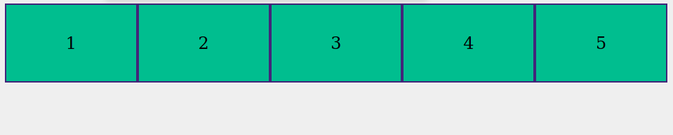
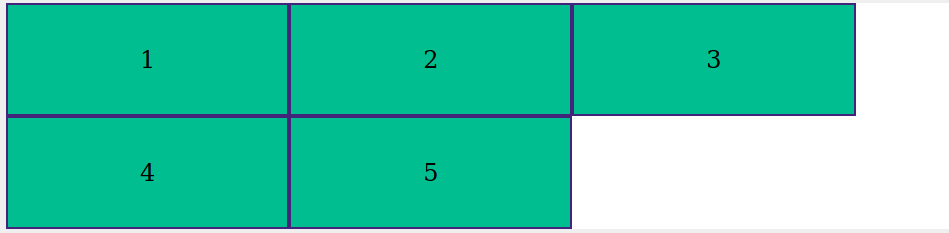
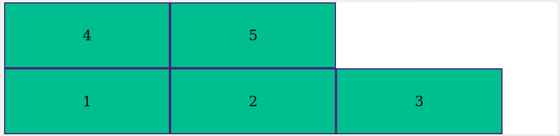

# Conteúdos

# Containers e Axes - flex-direction, flex-wrap, flex-flow

## Flex Containers e Flex Items
No *Flexbox*, tudo começa com uma linha de CSS:

    display: flex;

Esta propriedade faz com que o elemento HTML à qual ela foi aplicada se torne um *flex container*, enquanto todos os filhos *diretos* deste elemento se tornam *flex items*.

No exemplo abaixo, `main` é um container, e as `section`s são flex items. Já os elementos `h1` e `p` não são, visto que eles não são filhos **diretos** da `main`.

    <main>
      <section>
        <h1>Eu sou um header</h1>
        
Oi, eu sou um parágrafo.

      </section>

      <section>
        <h1>Também sou um header.</h1>
        
Queria ser um span.

      </section>
    </main>

    

Todas as propriedades que veremos hoje, com exceção de `align-self`, são propriedades aplicáveis em *flex containers*, **não** em *items*.

É importante ter bem nítida em mente essa distinção.

## Os axes e flex directions
O *Flexbox* dispõe os itens dentro de um container em dois *eixos*: o eixo principal (*main axis*) e o eixo cruzado (*cross axis*).

Você pode traçar um paralelo com o eixo x e y do plano cartesiano, mas é importante ter em mente que no Flexbox os eixos *não são iguais*. Um deles é o principal e o outro não.

O Flexbox é um layout *uni-dimensional*, ao contrário do que pode parecer a princípio. Isso quer dizer que temos linhas *ou* colunas, mas nunca ambos. O que dita qual dos dois layouts é usado é a propriedade `flex-direction`.

### Flex Direction
* Dita se o eixo principal vai ser *horizontal* ou *vertical*, com *linhas* ou *colunas*, respectivamente.
* Dita a orientação.
  * *Esquerda para a direita* ou *direita para a esquerda*, no caso do layout horizontal;
  * *Cima para baixo* ou *baixo para cima*, no caso do layout vertical.

Sintaxe:
    
    flex-direction: row|column|row-reverse|column-reverse;

* `flex-direction: row;` coloca o eixo principal como o horizontal, da esquerda para a direita. **Valor padrão**;
* `flex-direction: row-reverse;` coloca o eixo principal como o horizontal, da direita para a esquerda;
* `flex-direction: column;` coloca o eixo principal como o vertical, de cima para baixo;
* `flex-direction: column-reverse;` coloca o eixo principal como o vertical, de baixo para cima.

## Múltiplas linhas ou colunas
Embora o Flexbox seja um layout uni-dimensional, ele também permite alinhamento e organização no eixo cruzado, e uma das maneiras é através da possibilidade de dar ao container a capacidade de dispôr os itens em mais de uma linha ou coluna, caso o conteúdo "estoure" os limiares de seu tamanho.

Esta capacidade vem através da propriedade `flex-wrap`.

Vale lembrar que o layout *continua sendo tratado como uni-dimensional*. Você pode pensar o eixo principal como sendo uma longa linha (ou coluna), independentemente do `flex-wrap` adotado. O que esta propriedade faz é "quebrar" esta única linha ou coluna.

### Flex Wrap

A propriedade `flex-wrap` dita se um container deverá "quebrar" o conteúdo em várias linhas ou colunas, caso o tamanho total do conteúdo seja maior do que o tamanho do contâiner.

Sintaxe:

    flex-wrap: nowrap|wrap|wrap-reverse; 

* `flex-wrap: nowrap` mantém todo o conteúdo em apenas uma linha ou coluna . **Valor padrão**;
* `flex-wrap: wrap` quebra o conteúdo em mais de uma linha ou coluna, *caso o mesmo ultrapasse o tamanho relevante do contâiner*;
* `flex-wrap: wrap-reverse` funciona como `wrap`, porém inverte a ordem das linhas;

Flex container com linha única (no-wrap);

Flex container com linhas múltiplas (wrap).

Flex container com linhas múltiplas inversas (wrap-reverse).

## Flex Flow
`flex-flow` é um [*shorthand*](https://developer.mozilla.org/pt-BR/docs/Web/CSS/Shorthand_properties) (ou seja, uma abreviação de múltiplas propriedades) para `flex-direction` e `flex-wrap`;

Sintaxe:

    flex-flow: flex-direction flex-wrap;

Exemplos:
* `flex-flow: column wrap` coloca o eixo principal como vertical e expressa um layout de múltiplas linhas;
* `flex-flow: row` exatamente igual a `flex-direction: row`;

---

## Mãos na massa!

Copie o código abaixo e experimente com as propriedades `flex-direction`, `flex-wrap` e `flex-flow`:

> **NOTA**: [este arquivo HTML](./02-1_conteudo_pratica.html) é colocado como embed na página com o botão de "Copiar"
