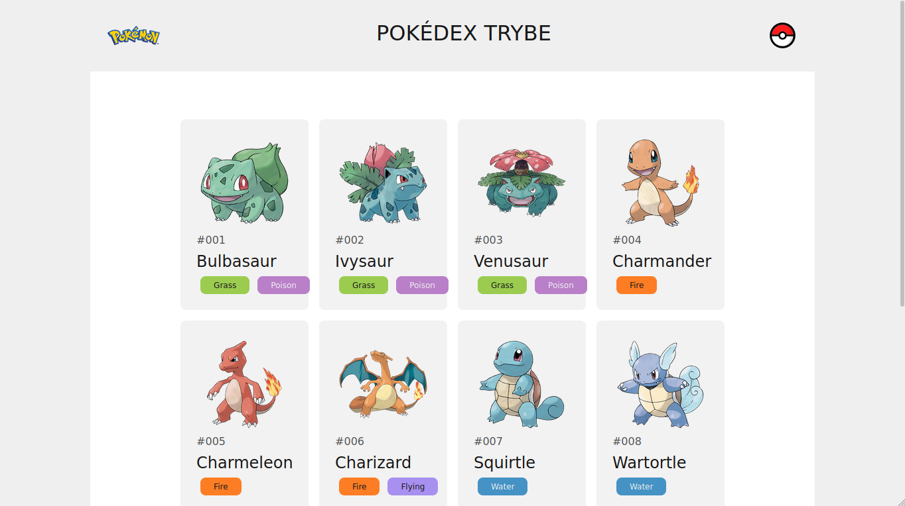
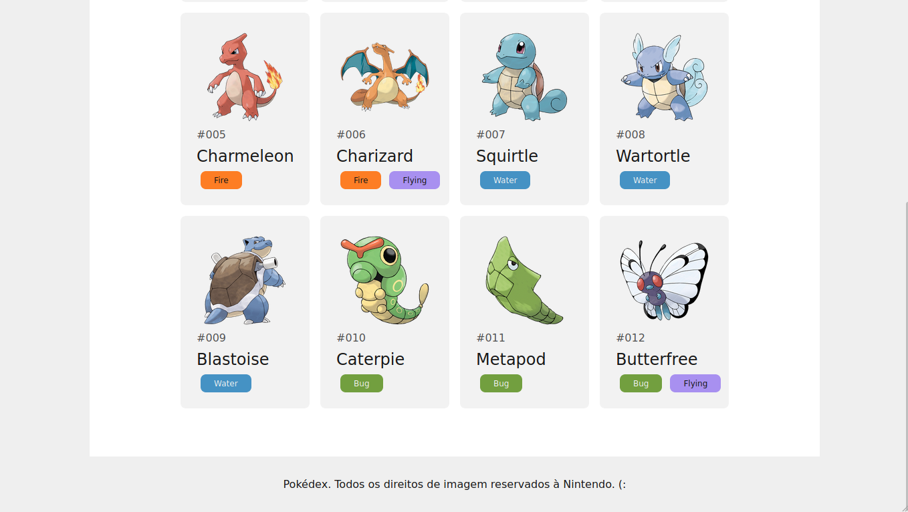

# Exercícios

>**NOTA:** Aqui é incluído o texto padrão sobre versionamento do repositório de exercícios.

## Exercicio - alinhamento com Flexbox

Para os exercícios a seguir, você somente precisará (e deverá!) utilizar as propriedades aprendidas na aula de hoje.

1. Alinhe o main ao centro do body. Certifique-se de que a orientação dos elementos dentro do body continue sendo de cima para baixo.

2. Alinhe o aside de modo que fique lado-a-lado com o article.

3. Alinhe os elementos dentro do aside ao centro. Novamente, certifique-se de que estejam no sentido de cima para baixo.

4. Alinhe os reviews de modo que fiquem dois por linha.
   
Arquivos:

>**NOTA**: Novamente os arquivos embed. Neste documento de processo seletivo, os arquivos são:
> * [HTML](./exercicio_01/04_exercicios.html)
> * [CSS](./exercicio_01/04_exercicios.css)
>
> O Gabarito está dentro da pasta "gabarito".

## Exercício bônus - Pokédex

Copie o design dos prints abaixo:

Todas as imagens estão *neste repositório*, dentro da pasta *img*.

>**NOTA**: Este exercício provavelmente seria configurado semelhantemente ao exercício Trybe Tech Gallery, como um repositório, devido à quantidade de imagens.
> O gabarito está dentro da pasta exercicio_bonus/gabarito

### Dicas

* Use `flex-wrap` para fazer com que as cards fiquem 4 por linha;
* Use uma das propriedades de `justify-content` para dispôr os itens do header;
* Use Flexbox para alinhar os itens dentro de cada card, bem como os tipos de cada pokémon.
