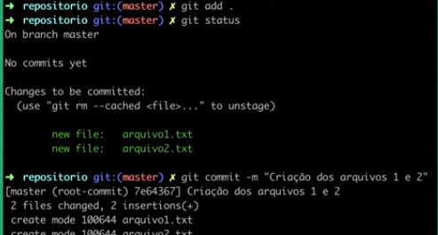
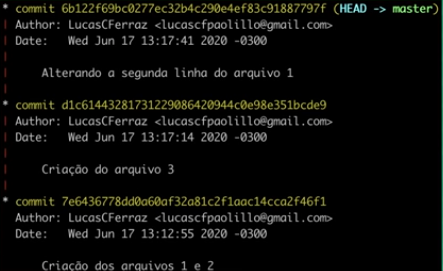
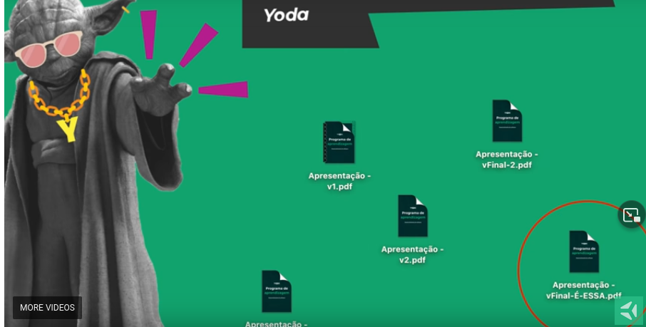

Você sabe o que é o git, qual a sua importância, qual sua importância e qual a diferença entre github, gitbucket e gitlab? Nesse vídeo eu responder essas perguntas.

Vem comigo.

_OE:_ Intro da Trybe

Fala tribo, beleza?

Eu sou o Lucas, um dos membros do time fundador da Trybe e uma das pessoas especialistas que vai te acompanhar durante toda a formação.
_OE:_ Tag aparece com: Lucas Ferraz. Instrutor.

Nesse vídeo, nós vamos ter uma introdução do que é o git, e qual a sua importância no mercado de trabalho hoje em dia.

Antes de começar, já se inscreve aqui no canal para ter conteúdos novos sobre tecnologia todas as semanas.
_OE_: animação para inscrever.

Mas então, o que é o git? O git é um mecanismo de controle de versão distribuído criado por Linus Torvald durante o desenvolvimento do próprio Linux.
_OE_: Imagem do Linus Torvald

Vou deixar aqui na descrição um link onde ele mesmo conta como foi o processo de decisão da criação do git. É um vídeo super legal, que eu recomendo.

De forma simples, o git guarda um conjunto de alterações em seus arquivos através dos commits.

O conjunto desses commits cria um histórico de alterações, todos os momentos cronológicos que o seu repositório viveu.

Isso faz com que você tenha um caminho claro para poder ir e voltar entre as diferentes versões que aquele conjunto de arquivos viveu.

No mundo de desenvolvimento de software, esse conjunto de arquivos vai ser justamente seu projeto.

Nos próximos videos falaremos tudo sobre o funcionamento dos commits, branches, e todas essas outras palavras que tão aí dentro do mundo do Git.

Bom, mas por que o Git é importante? Acho que primeiro vale ressaltar que, no mundo de tecnologia hoje em dia, saber sobre Git é fundamental para que você consiga trabalhar em equipe.

Vamos dar um passo atrás e pensar justamente por que que o Git te ajuda a trabalhar em equipe, em relação aos outros mecanismos de controle de versão que existiam anteriormente.

Os mecanismos de controle de versão tradicionais trabalhavam no modelo cliente-servidor, onde todo código estava justamente no servidor e as pessoas que acessavam eram um cliente.

Esse modelo gerava uma série de problemas na hora de trabalhar em equipe. Por quê? Porque, por exemplo, para você pedir para poder fazer alteração em um arquivo que o seu colega também está trabalhando, você precisava bloquear esse arquivo, o que travava o fluxo de trabalho ali daquelas pessoas.

Além disso, o Git é muito mais efetivo no ponto de vista de gestão de mudanças, gestão de alterações, a diferença entre um commit e outro, por exemplo.

Agora, imagina trabalhar com 10 pessoas no mesmo projeto, tendo que servir a esse modelo de block de arquivo. Era terrível. Eu passei por isso, inclusive.

Existe uma alternativa que é enviar o código via email né. Versão 1. Versão 2. Versão 3. Versão final. Mas isso, obviamente, não escala hoje.
_OE_: Imagem gradativamente mostrando novos arquivos com versões "finais"

Agora, imagina voltar uma alteração que não funcionou bem, ou ter que comparar duas versões sem um mecanismo que te dá as ferramentas para isso.

Em resumo, o Git veio justamente para ajudar o fluxo de trabalho de equipes de desenvolvimento de software.

Só que ele foi além. A gente encontra, inclusive, o uso do Git para diversas outras áreas. Você pode fazer o uso do Git, por exemplo, para gestão de conteúdo. Tecnologias como Github te dão ferramentas excelentes para que você possa contribuir no trabalho de outra pessoa.

Beleza, então você já aprendeu o que é o Git, e porque ele é importante. Mas agora a gente tem que entender qual a diferença entre Git, Github, Gitbucket e Gitlab.

Então, Git é o mecanismo de controle de versão em si. É nele que tem toda a engenharia, todo o código necessário, toda a programação, para garantir todo esse funcionamento que foi explicado anteriormente no que é o git.

Github, Gitbucket, Gitlab são plataformas que hospedam repositórios do Git. Então é um a forma de você deixar visível e distribuir para outras pessoas esse seu repositório do Git.

Além disso, essas plataformas contam com várias funcionalidades que ajudam no fluxo de desenvolvimento de software de uma equipe. Funcionalidades como Pull Request, controle de acesso, permissões em branches, e diversas outras funcionalidades que essas plataformas trazem.

Mas, de qualquer forma, é importante deixar claro que você não precisa de nenhuma dessas plataformas para usar o Git em si. Você pode usar ele simplesmente dando um git init em uma pasta local. Você também consegue distribuir o seu repositório Git sem necessariamente usar uma plataforma.

Então, fica a seu critério como você vai distribuir. Só que essas plataformas já tem um monte de funcionalidades prontas que te ajudam muito nesse fluxo de desenvolvimento. Então, faz bastante sentido usar no seu dia-a-dia como pessoa programadora.

Então, você aprendeu que o Git é uma forma de versionar arquivos, que você pode versionar código, texto, imagem, enfim, e guardar tudo siso dentro de uma pasta com versões específicas no tempo. Aprendeu também que o Git se diferencia principalmente por sua habilidade de ser distribuído e pela sua capacidade de gerir diferenças entre dois commits. Sabe também que Git, Github, Gitlab e Gitbucket são tecnologias diferentes com responsabilidades diferentes.

Gostou da aula? Então deixe seu like e, se ainda não se inscreveu no canal, se inscreve agora. ;)

No curso da Trybe, você terá muitas aulas como essa. Comigo, inclusive.

Para conhecer mais sobre a Trybe, acesse o site, faça o download do nosso Programa de Aprendizagem, e se inscreva no processo seletivo. Estamos com turmas abertas todos os meses.
